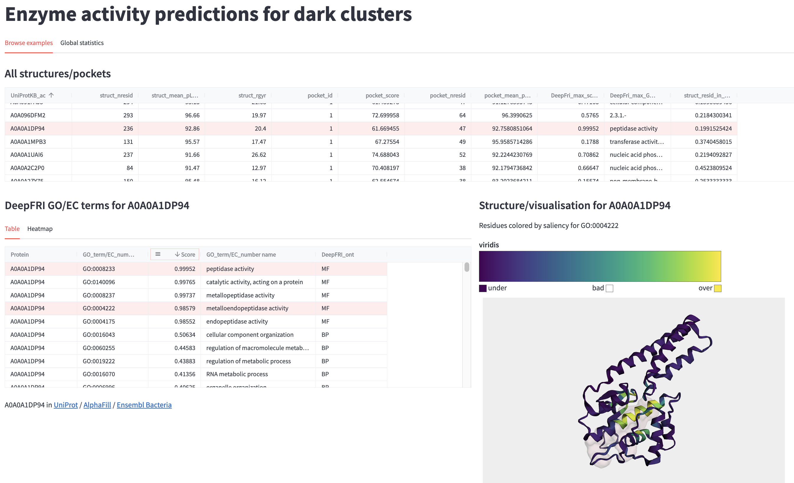

# Enzyme activity predictions for dark clusters

Web app visualising enzymatic activity-associated features (pockets, DeepFRI GO/EC results) on a subset of clusters derived from the [AlphaFold Protein Structure Database](https://alphafold.ebi.ac.uk).

The app was developed and tested on the Streamlit Community Cloud. A publicly accessible instance is currently accessible [at this address](https://jurgjn-af-protein-universe-app-mss2ap.streamlit.app/). Alternatively, you can fork the repository, and [deploy your own instance](https://docs.streamlit.io/streamlit-community-cloud/get-started/deploy-an-app).
